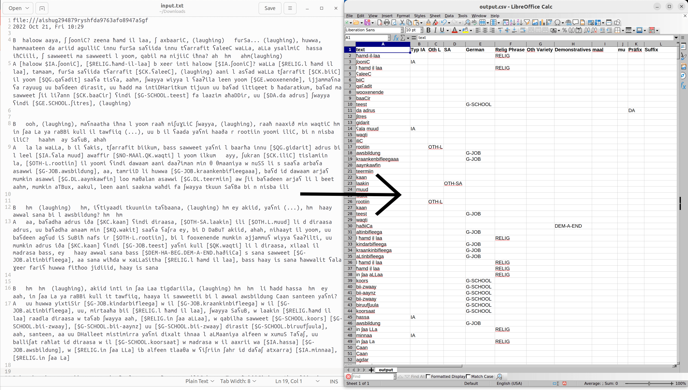

# TranscriptionTagger
Are you a linguist working with annotated corpora?

Did it take you 3 years to annotate and need to have it all nice and clean in a sharable format?

Well, despair no more, this is the tool for you!

TranscriptionTagger is a tool for converting between different formats of transcriptions. 
It is designed to be used with [ELAN](https://tla.mpi.nl/tools/tla-tools/elan/) and [Praat](https://www.fon.hum.uva.nl/praat/) annotation tools,
but can be used with any other tool that uses a similar format.

## Notebook
If you know nothing about programming, I highly advise you to use the [colab notebook](https://colab.research.google.com/github/nicofirst1/TranscriptionTagger/blob/main/main.ipynb).

