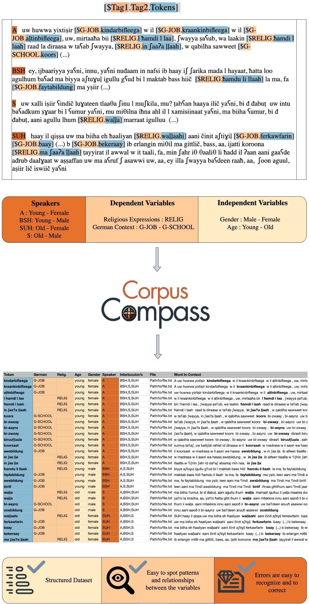

# CorpusCompass

<p align="center">
  
</p>

**CorpusCompass** is a user-friendly tool designed for researchers in **Corpus Linguistics** who want a simpler way to extract, manage, and analyze data from annotated corpora. Whether you’re studying under-resourced languages or more commonly researched varieties, CorpusCompass provides:

- Automatic detection of linguistic variables via **regex** patterns  
- Intuitive **graphical interface** built with PySide6 (Qt)  
- Tools for **speaker identification**, **annotation management**, and **CSV/JSON** output  
- Compatibility with widely used annotation tools such as **[ELAN](https://tla.mpi.nl/tools/tla-tools/elan/)** and **[Praat](https://www.fon.hum.uva.nl/praat/)**  

By defining variables (e.g., age, gender, dialect features) and specifying how to detect them in your transcripts, **CorpusCompass** aims to streamline workflows often performed manually in spreadsheets or code scripts—making advanced data analysis more approachable for linguists, even without deep programming skills.



---

## Table of Contents
- [CorpusCompass](#corpuscompass)
  - [Table of Contents](#table-of-contents)
  - [Key Features](#key-features)
  - [Installation from Release](#installation-from-release)
  - [Getting Started (Download \& Modify)](#getting-started-download--modify)
    - [1. Clone or Download the Repository](#1-clone-or-download-the-repository)
    - [2. Install Dependencies with Poetry](#2-install-dependencies-with-poetry)
    - [3. Activate Poetry (Optional)](#3-activate-poetry-optional)
    - [4. Run the Application](#4-run-the-application)
    - [Making Changes / Rebuilding UI](#making-changes--rebuilding-ui)
  - [Issues \& Support](#issues--support)
    - [Opening Issues](#opening-issues)
    - [Troubleshooting](#troubleshooting)
  - [Associated Publications \& Acknowledgments](#associated-publications--acknowledgments)

---

## Key Features

- **Comprehensive GUI**  
  Easily manage projects, import annotated files, detect speakers and annotation markers, and view results interactively.  
- **Customizable Variables**  
  Define independent and dependent variables (e.g., speaker demographics vs. linguistic features) to fit a wide range of studies.  
- **Annotation Previews**  
  Quickly test or preview how the tool detects annotation markers before final dataset creation.  
- **Flexible Exports**  
  Output your processed corpus data as CSV or JSON for statistical analysis in R, Python, Excel, or other platforms.  
- **Cross-Platform**  
  Built with PySide6 (Qt), running on Windows, macOS, and Linux.

---

## Installation from Release

We plan to provide **pre-built executables** for Windows and macOS. Once available, you can download them from the [Releases page](https://github.com/YourOrg/CorpusCompass/releases), then:

1. **Download** the `.exe` (Windows) or `.app/.dmg` (macOS).  
2. **Run/Install**: Just open or run the file—no separate Python environment needed.  
3. **Launch** CorpusCompass: Start analyzing your corpora immediately via the GUI.

*(Stay tuned for these release binaries!)*

---

## Getting Started (Download & Modify)

If you’re comfortable with GitHub or Python, follow these steps to customize or contribute to CorpusCompass.

### 1. Clone or Download the Repository

- **GitHub-savvy approach**:
  ```bash
  git clone https://github.com/nicofirst1/CorpusCompass
  cd CorpusCompass
  ```
- **No Git experience?**  
  Click the green “Code” button on GitHub and select “Download ZIP.” Then unzip on your computer.

### 2. Install Dependencies with Poetry

1. [Install Poetry](https://python-poetry.org/docs/#installation) (if you haven’t).  
2. In the repository folder, run:
   ```bash
   poetry install
   ```
   This downloads and installs all required packages (including PySide6) into a virtual environment.

### 3. Activate Poetry (Optional)

To work inside the environment:

```bash
poetry shell
```

Then launch:

```bash
python main.py
```

Alternatively, run:

```bash
poetry run python main.py
```

*(No manual environment activation needed.)*

### 4. Run the Application

Launching the GUI:

```bash
python main.py
```

- **Create a new project**: Provide a project name, description, and target directory.  
- **Open existing data**: Import or load pre-annotated text/corpus files.  
- Use the **Load Files** tab to add them into your project, tweak detection settings, define variables, or run the annotation preview.

### Making Changes / Rebuilding UI

If you modify `.ui` or `.qrc` files (e.g., adjusting the layout in Qt Designer or adding new icons):

1. **Compile `.ui`**:  
   ```bash
   pyside6-uic src/view/res/some_file.ui -o src/view/generated/ui_some_file.py
   ```
   or run:
   ```bash
   chmod +x compile_ui.sh
   ./compile_ui.sh
   ```
   to compile all UI files at once.
2. **Compile `.qrc`**:  
   ```bash
   pyside6-rcc resources.qrc -o resources_rc.py
   ```
3. **Re-run** `python main.py`.

---

## Issues & Support

### Opening Issues
- **Found a bug or glitch?** [Open an issue here](https://github.com/nicofirst1/CorpusCompass/issues/new/choose) and share the details.  
- **Feature requests** or suggestions? We welcome improvements from the community.  

### Troubleshooting

**UnicodeDecodeError**  
```
UnicodeDecodeError: 'utf-16-le' codec can't decode byte 0x0a ...
```
This might mean you have a text file with an odd number of bytes. A quick workaround is to add a space at the end of the file and retry.

---

## Associated Publications & Acknowledgments

This project was created in collaboration with researchers in Linguistics and Computer Science. We especially thank the students whose contributions and user‐centered design insights helped shape CorpusCompass’s current architecture.

**Associated Publications**:

1. **CorpusCompass: A Tool for Data Extraction and Dataset Generation in Corpus Linguistics**  
   *Muhadj Adnan, Nicolo’ Brandizzi (2023)*  
   In *Proceedings of the 9th Italian Conference on Computational Linguistics (CLiC-it 2023)*, CEUR Workshop Proceedings, Venice, Italy.  
   [CEUR Link](http://ceur-ws.org/Vol-3596/)  

2. **User-Centered Design of Digital Tools for Sociolinguistic Studies in Under-Resourced Languages**  
   *Jonas Adler, Carsten Scholle, Daniel Buschek, Nicolo’ Brandizzi, Muhadj Adnan (2024)*  
   In *Proceedings of the 3rd Workshop on NLP Applications to Field Linguistics (Field Matters 2024)*, ACL, Bangkok, Thailand.  

We appreciate citations of these works if CorpusCompass assists your academic research.

**Enjoy exploring your corpora with CorpusCompass!** If you have questions or feedback, please contact us via GitHub issues or email. We look forward to your contributions and research outcomes.