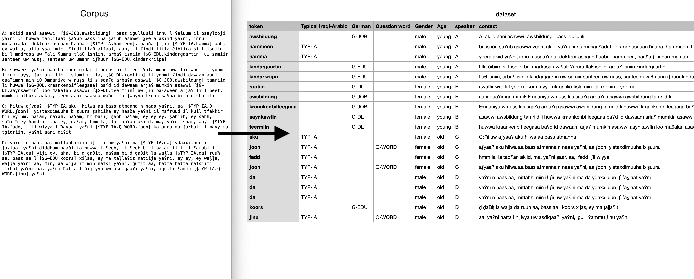

# TranscriptionTagger
Are you a linguist working with annotated corpora?

Did it take you 3 years to annotate and need to have it all nice and clean in a sharable format?

Well, despair no more, this is the tool for you!

TranscriptionTagger is a tool for converting between different formats of transcriptions. 
It is designed to be used with [ELAN](https://tla.mpi.nl/tools/tla-tools/elan/) and [Praat](https://www.fon.hum.uva.nl/praat/) annotation tools,
but can be used with any other tool that uses a similar format.

## Error reporting and feature requests
If you find a bug or have a feature request, please open an issue on the [issue tracker](https://github.com/nicofirst1/TranscriptionTagger/issues/new/choose)

## Notebook
This tool is designed to be used with a Jupyter notebook.
If you are not familiar with colab, check this tutorial on [how to use colab](https://colab.research.google.com/notebooks/intro.ipynb).

We have different notebooks for different tasks:

- [Converting a transcription to a csv dataset](https://colab.research.google.com/github/nicofirst1/TranscriptionTagger/blob/main/main.ipynb).

